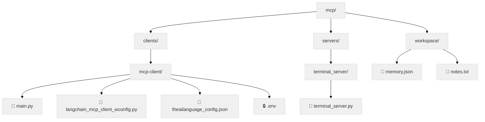
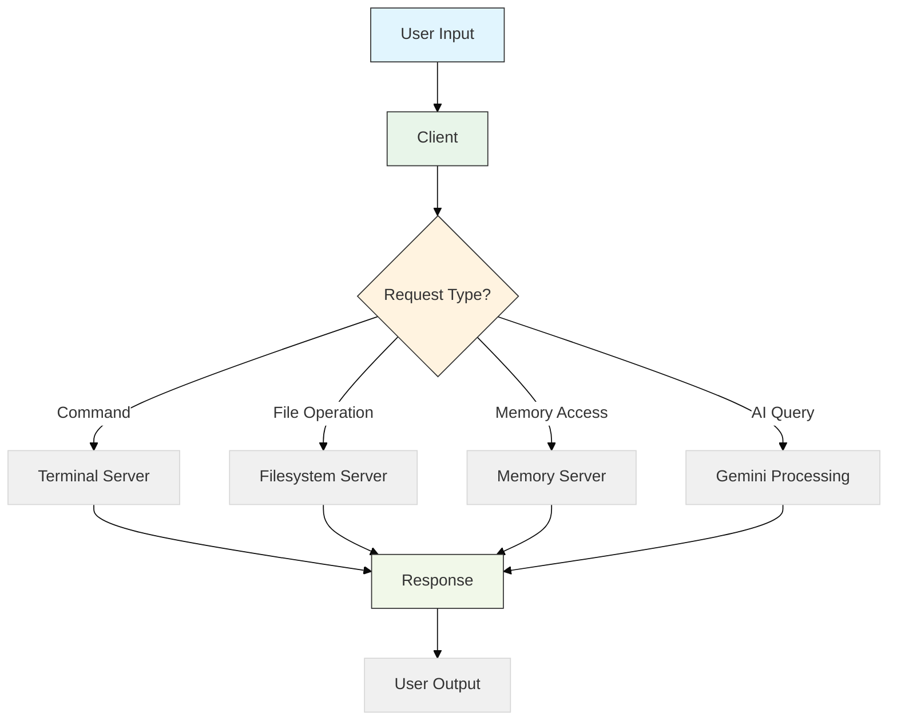
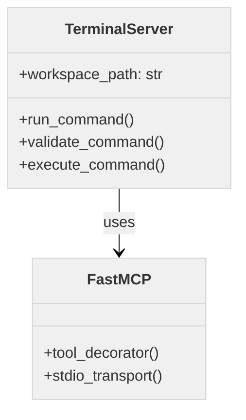

# MCP System Documentation

## 🚀 System Overview

```mermaid
%%{init: {'theme': 'base', 'themeVariables': { 'primaryColor': '#f0f0f0', 'nodeTextColor': '#333', 'edgeLabelBackground': '#fff'}}}%%
flowchart LR
    A[User] --> B[Client]
    B --> C[AI Processing\n(Gemini + LangChain)]
    B --> D[Terminal Server]
    B --> E[Filesystem Server]
    B --> F[Memory Server]
    style A fill:#e1f5fe,stroke:#333
    style B fill:#e8f5e9,stroke:#333
    style C fill:#fff3e0,stroke:#333
    style D fill:#f3e5f5,stroke:#333 
    style E fill:#e0f7fa,stroke:#333
    style F fill:#f1f8e9,stroke:#333
```

**Core Components:**
- **AI Processing**: Google Gemini + LangChain for natural language understanding
- **Terminal Server**: Executes system commands in isolated workspace
- **Filesystem Server**: Manages file operations
- **Memory Server**: Stores and retrieves persistent data

**Key Features:**
- Automatic server startup as needed
- Secure workspace isolation
- Flexible configuration
- Extensible architecture

## 📂 File Structure



**Key Files:**
- `clients/mcp-client/main.py`: Main client entry point
- `clients/mcp-client/langchain_mcp_client_wconfig.py`: AI integration
- `clients/mcp-client/theailanguage_config.json`: Server configurations
- `clients/mcp-client/.env`: Environment variables
- `servers/terminal_server/terminal_server.py`: Terminal server
- `workspace/memory.json`: Persistent memory storage
- `workspace/notes.txt`: System notes

**File Types:**
- Python (60%): Main application logic
- JSON (20%): Configuration files
- Text (15%): Documentation and notes
- Other (5%): Miscellaneous files

## 🔌 Client Components



### Main Client Files:
- `langchain_mcp_client_wconfig.py`: Main client application
- `theailanguage_config.json`: Server configurations
- `.env`: Environment variables

**Key Features:**
- Manages multiple MCP servers
- Integrates Google Gemini for natural language processing
- Handles dynamic response generation
- Processes LangChain objects

**Configuration:**
1. **theailanguage_config.json**:
```json
{
  "mcpServers": {
    "terminal_server": {
      "command": "uv",
      "args": ["run", "../../servers/terminal_server/terminal_server.py"]
    },
    "memory": {
      "command": "npx.cmd",
      "args": ["@modelcontextprotocol/server-memory"],
      "env": {"MEMORY_FILE_PATH": "workspace/memory.json"}
    }
  }
}
```

2. **.env Setup**:
```
GOOGLE_API_KEY=your_api_key_here
THEAILANGUAGE_CONFIG=clients/mcp-client/theailanguage_config.json
```

**Setup Steps:**
1. Create `.env` file in `clients/mcp-client/`
2. Add required variables
3. Restart client after changes

## 🖥️ Server Components



### Terminal Server
- **Purpose**: Executes system commands in isolated workspace
- **Key Features**:
  - Fast command execution
  - Secure workspace isolation
  - Comprehensive logging
- **Technical Details**:
  - Uses `FastMCP` for transport
  - Validates commands before execution
  - Captures and returns output

### Workspace Files

#### `memory.json`
- **Purpose**: Persistent data storage
- **Operations**:
  - Store/update/read data
  - Query specific information
- **Example Structure**:
```json
{
  "user_preferences": {
    "favorite_color": "blue",
    "interests": ["science fiction"]
  },
  "system_state": {
    "last_commands": ["git status", "ls"]
  }
}
```

#### `notes.txt`
- **Purpose**: System documentation and notes
- **Content Types**:
  - User documentation (40%)
  - System notes (30%)
  - Temporary data (20%)
  - Other (10%)

## 🛠️ Local Setup Guide

### Prerequisites
- Python 3.9+
- Node.js 16+
- Google API Key
- UV Package Manager

### Installation Steps
1. **Clone the repository**:
   ```bash
   git clone https://github.com/modelcontextprotocol/mcp.git
   cd mcp
   ```

2. **Set up Python environment**:
   ```bash
   python -m venv venv
   # Linux/Mac:
   source venv/bin/activate
   # Windows:
   venv\Scripts\activate
   pip install -r requirements.txt
   ```

3. **Configure environment variables**:
   ```bash
   echo "GOOGLE_API_KEY=your_key_here" > clients/mcp-client/.env
   echo "THEAILANGUAGE_CONFIG=clients/mcp-client/theailanguage_config.json" >> clients/mcp-client/.env
   ```

4. **Install Node.js servers**:
   ```bash
   npm install -g @modelcontextprotocol/server-memory @modelcontextprotocol/server-filesystem
   ```

**Verification Checklist**:
- [x] Repository cloned
- [x] Python virtual environment created and activated
- [x] Python dependencies installed
- [x] .env file configured
- [x] Node.js servers installed

## 🚀 Usage Instructions

### Basic Usage
1. Start the client:
```bash
python clients/mcp-client/langchain_mcp_client_wconfig.py
```

2. Type natural language requests and receive responses

### Command Examples

**File Operations**:
```bash
Create a file named example.txt
Search for "function" in all Python files
Count lines in main.py
```

**Web Content**:
```bash
Summarize https://example.com
Extract headlines from news site
```

**System Commands**:
```bash
List files in current directory
Check Python version
Run git status
```

**Memory Operations**:
```bash
Remember my favorite color is blue
What preferences did I set?
Show recent commands
```

## Server Configuration

**Key Configuration Files**:
- `theailanguage_config.json`: Main server configurations
- `.env`: Environment variables

**Example Server Configs**:
```json
{
  "terminal_server": {
    "command": "uv",
    "args": ["run", "servers/terminal_server/terminal_server.py"]
  },
  "memory": {
    "command": "npx.cmd",
    "args": ["@modelcontextprotocol/server-memory"],
    "env": {"MEMORY_FILE_PATH": "workspace/memory.json"}
  }
}
```

**Configuration Tips**:
- Use absolute paths for reliability
- Set environment variables for sensitive data
- Restart servers after configuration changes

## 🛠️ Troubleshooting

**Common Issues & Solutions**:

1. **Authentication Problems**:
   - Verify Google API key in `.env`
   - Check key has proper permissions
   - Regenerate key if needed

2. **File Operations Failing**:
   ```bash
   # Check permissions
   ls -la workspace/
   
   # Restart filesystem server
   npx @modelcontextprotocol/inspector uvx mcp-server-filesystem
   ```

3. **Memory Operations Failing**:
   ```bash
   # Verify memory.json exists
   ls workspace/memory.json
   
   # Restart memory server
   npx @modelcontextprotocol/server-memory
   ```

**Debugging Tools**:
- Enable verbose logging:
  ```bash
  echo "LOG_LEVEL=DEBUG" >> clients/mcp-client/.env
  ```
- List running servers:
  ```bash
  npx @modelcontextprotocol/inspector list
  ```

**Support**:
- [Documentation](https://github.com/modelcontextprotocol/mcp/wiki)
- [Report Issues](https://github.com/modelcontextprotocol/mcp/issues)

## 🤝 How to Contribute

**Getting Started**:
1. Fork and clone the repository
2. Set up development environment (see Local Setup Guide)

**Development Workflow**:
```bash
# Create feature branch
git checkout -b feature/your-feature

# Make changes following:
# - Python: PEP 8 style
# - JavaScript: StandardJS style
# - Document all new functions

# Run tests
python -m pytest tests/

# Push changes
git push origin feature/your-feature
```

**Pull Requests**:
- Reference related issues
- Describe changes clearly
- Include test results
- Squash commits before merging

**Code Review**:
- Reviews typically within 48 hours
- Address all feedback before merging

**Recommended Setup**:
- VSCode with Python/JS extensions
- Docker for testing
- Pre-commit hooks
