# MCP System Documentation

## 🚀 System Overview

```mermaid
%%{init: {'theme': 'base', 'themeVariables': { 'primaryColor': '#ffd8d8', 'edgeLabelBackground':'#fff'}}}%%
flowchart TD
    A[📝 User Input] --> B[💻 LangChain Client]
    B --> C[🧠 Google Gemini]
    C --> D{🔀 Action Type?}
    D -->|🛠️ Requires Tool| E[⚙️ Select MCP Server]
    D -->|💬 Direct Response| F[📤 Generate Answer]
    E --> G[🖥️ Terminal Server]
    E --> H[🗄️ Other Servers]
    G --> I[⌨️ Execute Command]
    I --> J[📁 Workspace]
    J --> K[📨 Return Results]
    H --> L[⚡ Execute Tool]
    L --> M[📨 Return Results]
    K --> B
    M --> B
    F --> N[💬 Output Response]
```



**Key Components:**


**Features:**
- 🤖 **AI Integration**: Google Gemini + LangChain
- 🔌 **Server Architecture**: Terminal, Filesystem, Memory
- 📂 **Workspace**: Isolated environment
- ⚡ **Automatic**: Servers start on demand

## 📂 File Structure

```mermaid
%%{init: {'theme': 'neutral', 'fontFamily': 'monospace'}}%%
flowchart TD
    A[mcp/] --> B[clients/]
    A --> C[servers/]
    A --> D[workspace/]
    
    B --> E[mcp-client/]
    E --> F["📄 main.py"]
    E --> G["📄 langchain_mcp_client_wconfig.py"]
    E --> H["📄 theailanguage_config.json"]
    E --> I["🔒 .env"]
    
    C --> J[terminal_server/]
    J --> K["📄 terminal_server.py"]
    
    D --> L["📄 memory.json"]
    D --> M["📄 notes.txt"]
    D --> N["📄 system_flowchart.mmd"]
```



**Key Directories:**


**File Types Breakdown:**


**Quick Reference:**
- 🐍 **Python Files**: Main application logic
- 📋 **Config Files**: Server settings and environment
- 💾 **Workspace**: Persistent data storage

## 🔌 Client Components

### `langchain_mcp_client_wconfig.py`


**Key Features:**
- 🛠️ **Tool Orchestration**: Manages multiple MCP servers
- 🤖 **AI Integration**: Google Gemini for natural language
- 🔄 **React Agent**: Dynamic response generation
- 📦 **Custom Encoder**: Handles LangChain objects

**Key Functions:**


### `theailanguage_config.json`


**Example Configuration:**
```json
{
    "mcpServers": {
        "terminal_server": {
            "command": "uv",
            "args": ["run", "../../servers/terminal_server/terminal_server.py"]
        },
        "memory": {
            "command": "npx.cmd",
            "args": ["@modelcontextprotocol/server-memory"],
            "env": {"MEMORY_FILE_PATH": "workspace/memory.json"}
        }
    }
}
```

### `.env`
**Required Variables:**


**Example:**
```
GOOGLE_API_KEY=your_api_key_here
THEAILANGUAGE_CONFIG=clients/mcp-client/theailanguage_config.json
```

## 🖥️ Server Components

### `terminal_server.py`


**Key Features:**
- ⚡ **Fast Execution**: Minimal overhead for command processing
- 🔒 **Workspace Isolation**: Commands run in controlled environment
- 📝 **Comprehensive Logging**: All operations recorded

**Technical Details:**


### Workspace Files

#### `memory.json`


**Structure Example:**
```json
{
  "user_preferences": {
    "favorite_color": "blue",
    "interests": ["science fiction"]
  },
  "system_state": {
    "last_commands": ["git status", "ls"]
  }
}
```

#### `notes.txt`


**Example Content:**
```
# System Notes
- Configured terminal server on 2023-11-15
- Updated memory server configuration

# User Notes
- Need to add more test cases
- Check API rate limits
```

## 🛠️ Local Setup Guide

### Prerequisites


### Installation Steps


**Detailed Instructions:**

1. **Clone the repository**
   ```bash
   git clone https://github.com/modelcontextprotocol/mcp.git
   cd mcp
   ```

2. **Set up virtual environment**
   ```mermaid
   flowchart LR
       A[Create Venv] --> B[Activate]
       B --> C[Install Dependencies]
   ```
   ```bash
   python -m venv venv
   # Linux/Mac:
   source venv/bin/activate
   # Windows:
   venv\Scripts\activate
   ```

3. **Install Python dependencies**
   ```bash
   pip install -r requirements.txt
   ```

4. **Configure environment**
   ```bash
   echo "GOOGLE_API_KEY=your_key_here" > clients/mcp-client/.env
   echo "THEAILANGUAGE_CONFIG=clients/mcp-client/theailanguage_config.json" >> clients/mcp-client/.env
   ```

5. **Install Node.js components**
   ```bash
   npm install -g @modelcontextprotocol/server-memory
   npm install -g @modelcontextprotocol/server-filesystem
   ```

**Verification Checklist:**
- [ ] Python virtual environment activated
- [ ] All Python packages installed
- [ ] Node.js modules installed globally
- [ ] .env file properly configured

## 🚀 Usage Instructions


### Getting Started
1. **Launch the client** (servers will start automatically):
```bash
python clients/mcp-client/langchain_mcp_client_wconfig.py
```

2. **Interact** through the chat interface:


### Example Prompts by Category

#### 📂 File Operations

1. **Basic file operations**:
   - "Create file notes.txt with content 'Hello World'"
   - "Show me the contents of workspace/memory.json"
   - "Delete the file temp.txt from workspace"

2. **Advanced operations**:
   - "Search all files containing 'JARVIS' in the workspace"
   - "Count lines in all Python files in the project"

#### 🌐 Web Content

1. **Content retrieval**:
   - "Get summary from https://example.com/about"
   - "Extract headings from https://docs.example.org"

2. **Specific requests**:
   - "Read first 2000 chars from https://news.example.com"
   - "Find contact info on https://company.example.com"

#### 💻 Terminal Commands

1. **System information**:
   - "Show Python version"
   - "List environment variables"

2. **Workspace operations**:
   - "Run 'git status' in workspace"
   - "Count files in current directory"

#### 🧠 Memory Operations
```mermaid
journey
    title Memory Interactions
    section Storage
      Add Info: 4: User
      Update: 3: User
    section Retrieval
      Recall: 5: User
      Query: 3: User
```
1. **Personal preferences**:
   - "Remember I like science fiction"
   - "What do you know about my interests?"

2. **System state**:
   - "Store last command output"
   - "Recall previous workspace changes"

## Mermaid Flowcharts

### Terminal Server Flow
```mermaid
flowchart TD
    A[Client Request] --> B[Parse Command]
    B --> C[Validate]
    C --> D[Execute in Workspace]
    D --> E[Capture Output]
    E --> F[Return Results]
```

### LangChain Client Flow
```mermaid
flowchart TD
    A[User Input] --> B[Gemini Processing]
    B --> C{Tool Needed?}
    C -->|Yes| D[Route to Server]
    C -->|No| E[Generate Response]
    D --> F[Get Tool Results]
    F --> E
    E --> G[Output to User]
```

### Memory Server Flow
```mermaid
flowchart TD
    A[Query] --> B[Check Memory]
    B --> C{Found?}
    C -->|Yes| D[Return Memory]
    C -->|No| E[Create New Entry]
    E --> D
```

## Server Configuration (uvx/npx)

### Fetch Server Setup
```json
{
  "mcpServers": {
    "fetch": {
      "command": "uvx",
      "args": ["mcp-server-fetch"]
    }
  }
}
```

### Filesystem Server Setup
```json
{
  "mcpServers": {
    "filesystem": {
      "command": "npx",
      "args": [
        "-y",
        "@modelcontextprotocol/server-filesystem",
        "C:\\Users\\Lenovo\\OneDrive\\Desktop",
        "C:\\Users\\Lenovo\\OneDrive\\Desktop\\final JARVIS\\mcp\\workspace"
      ]
    }
  }
}
```

### Memory Server Setup
```json
{
  "mcpServers": {
    "memory": {
      "command": "npx",
      "args": [
        "-y",
        "@modelcontextprotocol/server-memory"
      ],
      "env": {
        "MEMORY_FILE_PATH": "workspace/memory.json"
      }
    }
  }
}
```

## 🛠️ Troubleshooting Guide

```mermaid
journey
    title Troubleshooting Process
    section Identification
      Observe Issue: 3: User
      Check Logs: 3: System
    section Resolution
      Common Fixes: 4: System
      Advanced Debug: 3: Developer
    section Verification
      Test Solution: 3: User
      Confirm Fix: 2: System
```

### Common Issues and Solutions

#### 🔑 Authentication Problems
```mermaid
flowchart TD
    A[API Error] --> B{Check .env}
    B -->|Missing Key| C[Set GOOGLE_API_KEY]
    B -->|Invalid Key| D[Regenerate Key]
    C --> E[Restart Client]
    D --> E
```

1. **Google API key not working**:
   - Verify key is set in `clients/mcp-client/.env`
   - Ensure key has proper permissions
   - Regenerate key if needed

#### 🗄️ Filesystem Issues
```mermaid
pie
    title Filesystem Problems
    "Permissions" : 40
    "Path Errors" : 30
    "Server Not Running" : 20
    "Other" : 10
```

2. **Filesystem operations failing**:
   - Check workspace directory permissions
   - Verify paths in `theailanguage_config.json`
   - Ensure filesystem server is running:
     ```bash
     npx @modelcontextprotocol/inspector uvx mcp-server-filesystem
     ```

#### 💾 Memory Server Problems
3. **Memory operations not working**:
   - Check `memory.json` exists in workspace
   - Verify file permissions
   - Restart memory server:
     ```bash
     npx @modelcontextprotocol/server-memory
     ```

### Advanced Debugging

#### 📝 Log Collection
```mermaid
flowchart LR
    A[Client Logs] --> B[Terminal Output]
    C[Server Logs] --> B
    D[System Logs] --> B
```

1. **Enable verbose logging**:
   - Add to `.env`:
     ```
     LOG_LEVEL=DEBUG
     ```

2. **Inspect running servers**:
   ```bash
   npx @modelcontextprotocol/inspector list
   ```

#### 🧩 Component Testing
```mermaid
journey
    title Isolation Testing
    section Terminal
      Test Command: 3: User
      Verify Output: 2: System
    section Memory
      Store Data: 2: User
      Recall Data: 2: System
    section Filesystem
      Create File: 2: User
      Read Back: 2: System
```

1. **Test components individually**:
   - Terminal: `uv run servers/terminal_server/terminal_server.py "ls"`
   - Memory: `npx @modelcontextprotocol/server-memory get /user_preferences`
   - Filesystem: `npx @modelcontextprotocol/server-filesystem list ./workspace`

### Support Resources
- [Documentation](https://github.com/modelcontextprotocol/mcp/wiki)
- [Issue Tracker](https://github.com/modelcontextprotocol/mcp/issues)
- Community Forum (coming soon)

## 🤝 Contributing Guidelines

```mermaid
journey
    title Contribution Workflow
    section Setup
      Fork Repo: 3: Contributor
      Clone Locally: 3: Contributor
    section Development
      Create Branch: 3: Contributor
      Make Changes: 4: Contributor
      Test Changes: 3: Contributor
    section Submission
      Push Changes: 3: Contributor
      Open PR: 3: Contributor
    section Review
      Code Review: 4: Maintainer
      Merge: 2: Maintainer
```

### Getting Started
1. **Fork the repository** on GitHub
2. **Clone your fork** locally:
   ```bash
   git clone https://github.com/YOUR-USERNAME/mcp.git
   cd mcp
   ```

### Development Process
```mermaid
flowchart TD
    A[Create Feature Branch] --> B[Implement Changes]
    B --> C[Write Tests]
    C --> D[Update Documentation]
    D --> E[Commit Changes]
```

1. **Create a feature branch**:
   ```bash
   git checkout -b feature/your-feature-name
   ```

2. **Follow coding standards**:
   - Python: PEP 8 style guide
   - JavaScript: StandardJS style
   - Document all new functions

3. **Test your changes**:
   ```bash
   python -m pytest tests/
   ```

### Submitting Changes
```mermaid
pie
    title PR Requirements
    "Working Code" : 30
    "Tests" : 25
    "Documentation" : 25
    "Issue Reference" : 20
```

1. **Push your branch**:
   ```bash
   git push origin feature/your-feature-name
   ```

2. **Open a Pull Request**:
   - Reference any related issues
   - Describe changes clearly
   - Include test results

### Code Review Process
```mermaid
flowchart LR
    A[PR Opened] --> B[Automated Checks]
    B --> C[Review Requested]
    C --> D[Approval]
    D --> E[Merge]
```

- Maintainers will review within 48 hours
- Address all review comments
- Squash commits before merging

### Development Environment
```mermaid
classDiagram
    class DevEnvironment {
        +Python 3.9+
        +Node.js 16+
        +Docker (optional)
        +VSCode (recommended)
    }
    class Extensions {
        +Python
        +ESLint
        +Mermaid
        +Prettier
    }
    DevEnvironment --> Extensions
```

**Recommended Tools:**
- VSCode with Python/JS extensions
- Docker for server testing
- Pre-commit hooks for linting
